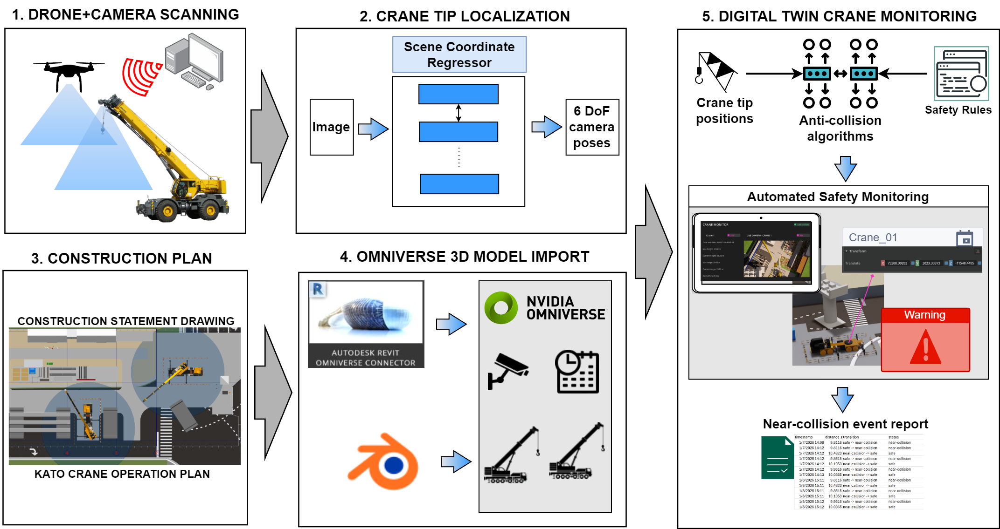
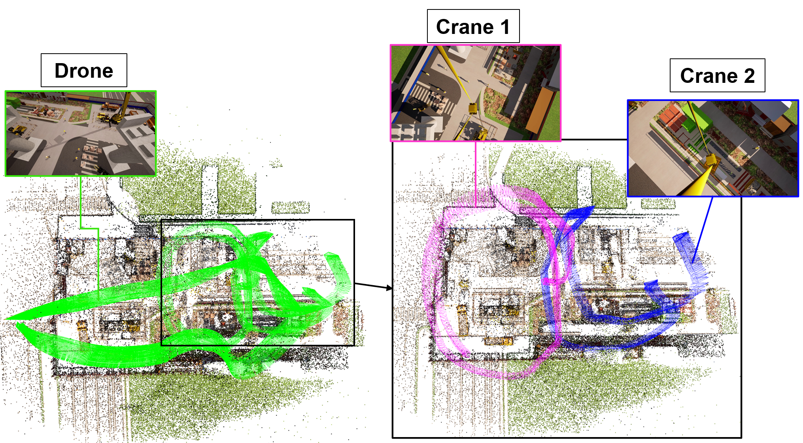
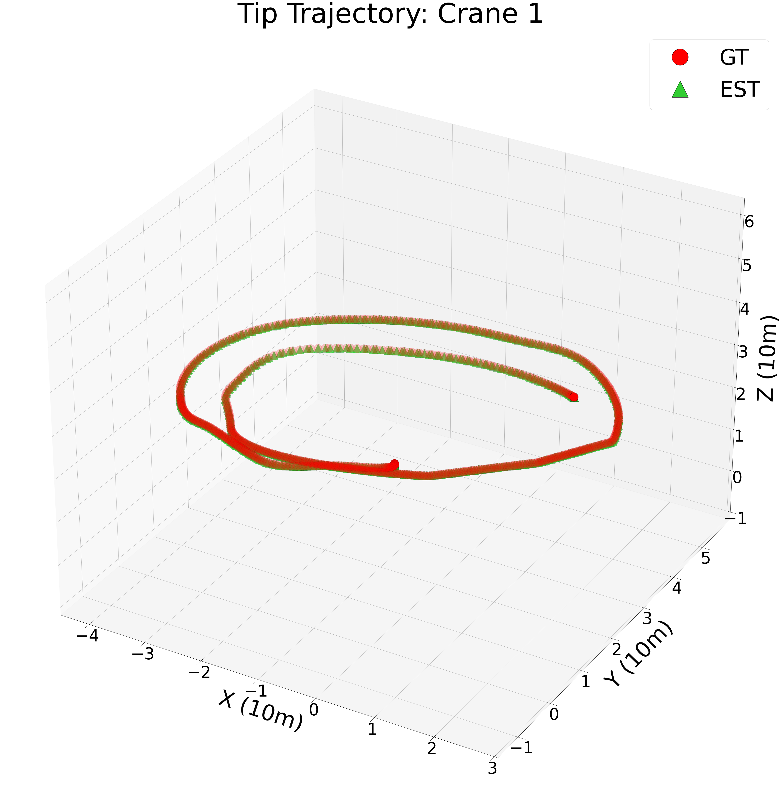
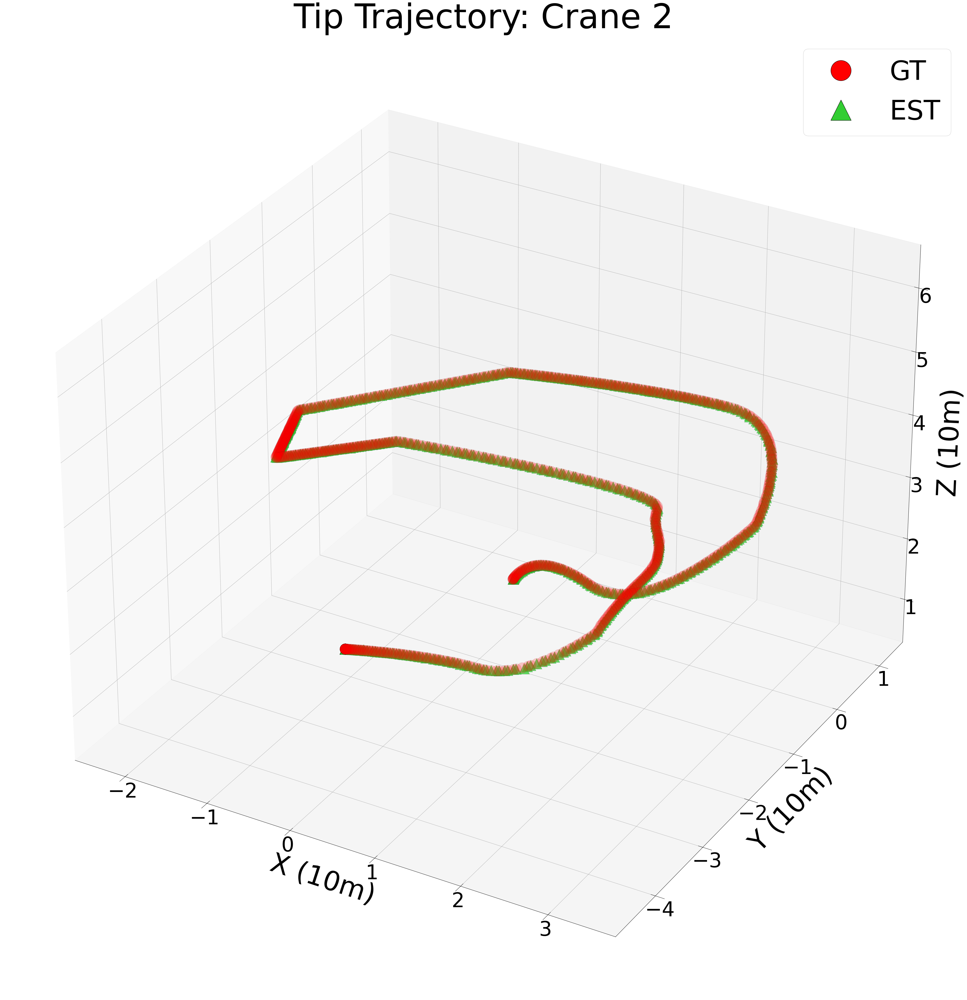
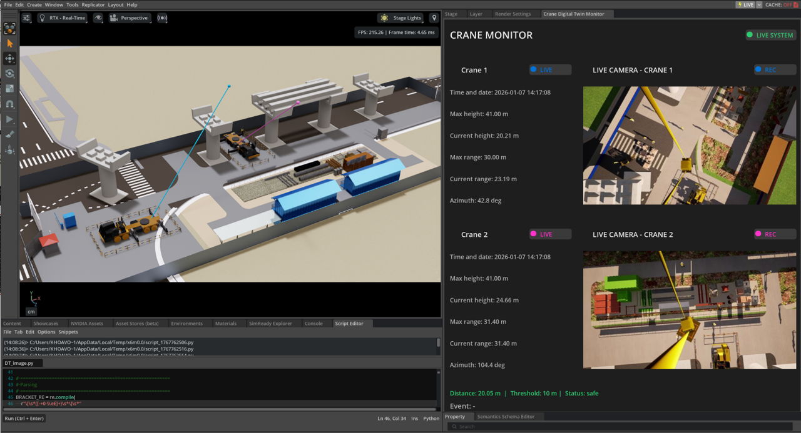
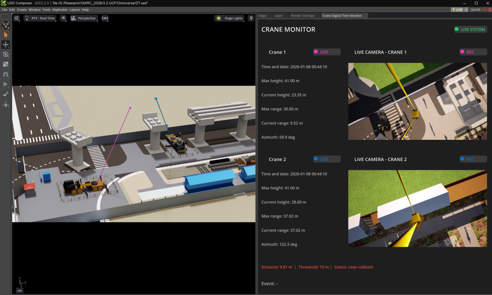

# DT-SCR-CRANES: Scene Coordinate Regression–Based Spatial Awareness for Advanced Multi-Crane Safety Monitoring in Construction Sites
DT-SCR-CRANES is a vision-based framework for real-time multi-crane safety monitoring using Scene Coordinate Regression (SCR). It directly estimates 6-DoF crane tip poses from monocular images without feature matching or additional sensors.Crane-mounted and drone imagery are fused to build scene-specific spatial representations and integrated into NVIDIA Omniverse digital twin for real-time visualization and automated near-collision detection.
## Proposed Approach

## Sample results
#### Data Collection
Drone and Crane-mounted camera for data collection

#### Visual Localization
Performance of crane-tip localization
| Crane 1 | Crane 2 |
|--------|---------|
|  |  |
#### NVIDIA Omniverse Digital Twin 
Performance of crane-tip localization
| Safety | Near-Collision|
|--------|---------|
|  |  |
## Demo

https://github.com/user-attachments/assets/836c174f-2e56-47f0-99c8-24e2fbeadef0

